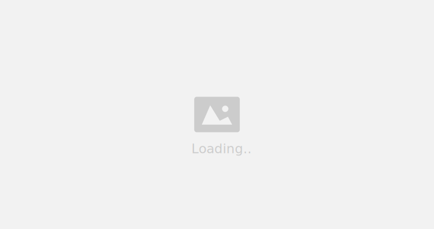

# Twitch Menu

<!--toc:start-->
- [Twitch Menu](#twitch-menu)
  - [Installation](#📦-installation)
  - [Usage](#🛠️-usage)
  - [Screenshots](#🖼️-screenshots)
  - [References and links](#🔗-references-and-links)
<!--toc:end-->

A user-friendly tool for easily accessing and watching live streams, videos, and clips from Twitch, it presents a menu interface for seamless browsing and streaming.


## 📦 Installation

```bash
# Clone repository
$ git clone "https://github.com/haaag/twitch-menu.git"
$ cd profiles-browser-python

# Create virtual environment & source
$ python -m venv .venv
$ source .venv/bin/activate

# Install requirements
$ (.venv) pip install -r requirements.txt
```

<br>

## 🛠️ Usage

```bash
usage: main.py [-h] [--rofi] [--lines [LINES]] [--player [PLAYER]] [--bottom] [--mixed] [--live] [--test]

Simple tool menu for watching streams live, video or clips from Twitch.

options:
  -h, --help         show this help message and exit
  --rofi             Set launcher to Rofi (default: dmenu)
  --lines [LINES]    Show dmenu in lines (default: 12 lines)
  --player [PLAYER]  Player (default: mpv)
  --bottom           Show dmenu bottom
  --mixed            All channels, live with icon.
  --live             Show live streams
```
<br>

## 🖼️ Screenshots

### Dmenu



### Rofi


## 🔗 References and links

- [Twitch API Docs](https://dev.twitch.tv/docs/api/reference)
- [Twitch token generator](https://twitchtokengenerator.com/)
  - Scope: `user:read:follows`
- [Twitch Channel ID and User ID Convertor](https://www.streamweasels.com/tools/convert-twitch-username-to-user-id/)

<br> 

## TODO

- [ ] Complete Usage
- [ ] Update screenshots
